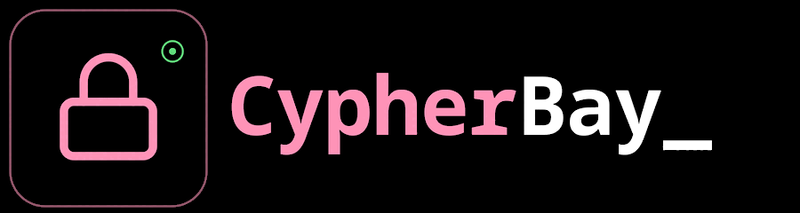

<p align="center">
  
</p>

<p align="center">
  <strong>Anonymous, end-to-end encrypted web chat, no accounts, no logs</strong>
</p>

<p align="center">
  <a href="LICENSE"></a>
  
  
  
  
</p>

---

```
root@cypherbay:~$ cat about.txt
```

CypherBay is a self-hosted, browser-based chat. No registration, no persistent accounts. Open a session, share the ID and a password out-of-band, and the conversation stays between you. The server stores only ciphertext it cannot read. Sessions and uploaded files auto-expire after one hour and seven days respectively.

## Crypto

All encryption runs entirely in the browser via the Web Crypto API: no crypto library, no server-side keys.

**Messages:** Keys are derived with PBKDF2-SHA256 at 310,000 iterations, salted with `CypherBay-v2-<sessionId>`. Each message is encrypted with AES-256-GCM using a fresh random 96-bit IV. What reaches the server is `base64(IV ‖ ciphertext)`. The password never leaves the client.

**Files:** Before upload, files are encrypted in the browser with the same AES-256-GCM session key. The server receives and stores an opaque binary blob: no filename, no MIME type, no readable content. Decryption happens in the receiver's browser. Anyone with a direct file URL sees random bytes.

## Limitations

The server sees your IP address and connection timestamps. If real anonymity matters, use Tor Browser. The session ID and password must be shared through a separate channel; sending the password in the chat defeats the purpose. This is not a replacement for Signal.

## Setup

Requires PHP 7.4+ and any web server. HTTPS is required; the API endpoints reject plain HTTP.

```bash
git clone https://github.com/cypherbay-net/webchat.git cypherbay
cd cypherbay
mkdir -p data/sessions data/ratelimit data/uploads
chmod 700 data/sessions data/ratelimit
chmod 755 data/uploads
php -S localhost:8000
```

**Nginx**

```nginx
server {
    listen 443 ssl http2;
    server_name chat.yourdomain.com;
    root /var/www/cypherbay;
    index index.html;

    ssl_certificate     /etc/ssl/certs/cert.pem;
    ssl_certificate_key /etc/ssl/private/key.pem;

    location ~ \.php$ {
        fastcgi_pass unix:/var/run/php/php-fpm.sock;
        fastcgi_param SCRIPT_FILENAME $document_root$fastcgi_script_name;
        include fastcgi_params;
    }

    location / { try_files $uri $uri/ /index.html; }
    location /data/ { deny all; }
}
```

**Apache**

```apache
<VirtualHost *:443>
    ServerName chat.yourdomain.com
    DocumentRoot /var/www/cypherbay

    SSLEngine on
    SSLCertificateFile    /path/to/cert.pem
    SSLCertificateKeyFile /path/to/key.pem

    <Directory "/var/www/cypherbay/data">
        Require all denied
    </Directory>
</VirtualHost>
```

Add a cron job to clean up expired sessions:

```bash
*/5 * * * * php /var/www/cypherbay/api/cleanup.php > /dev/null 2>&1
```

Uploaded files older than 7 days are deleted automatically on each new upload. No separate cron needed.

## Rate limiting

Per-IP, fixed 60-second windows written to `data/ratelimit/`. Typing signals are excluded.

| Endpoint | Limit |
|---|---|
| `api/send.php` | 40 / min |
| `api/messages.php` | 180 / min |
| `api/upload.php` | 5 / min |
| `api/delete.php` | 10 / min |

## Structure

```
cypherbay/
├── index.html
├── changelog.html
├── css/style.css
├── js/
│   ├── app.js          : UI, polling, message handling, file encryption
│   ├── crypto.js       : PBKDF2 + AES-256-GCM via Web Crypto API
│   └── qrcode.js       : QR code renderer (alphanumeric + byte mode, no deps)
├── api/
│   ├── send.php        : store encrypted message or typing signal
│   ├── messages.php    : fetch messages since timestamp
│   ├── upload.php      : store encrypted file blob locally
│   ├── file.php        : serve encrypted file blob by ID
│   ├── delete.php      : delete a session
│   ├── cleanup.php     : CLI, remove expired sessions
│   └── ratelimit.php   : file-based per-IP rate limiter
└── data/
    ├── sessions/       : one JSON file per active session (auto-expire 1h)
    ├── uploads/        : encrypted file blobs (auto-expire 7d)
    └── ratelimit/      : one JSON file per IP per endpoint
```

## How messages flow

```
Browser A                      Server                       Browser B
─────────────────────────────────────────────────────────────────────
encrypt(msg, key)  ──────────► store ciphertext ◄────── poll /messages
                               (cannot decrypt)  ──────► decrypt(msg, key)
```

## How file sharing works

```
Browser A                           Server                      Browser B
────────────────────────────────────────────────────────────────────────
encrypt(file, key) ───── encrypted blob ──────► store opaque blob
send URL in message ────────────────────────────────────────────────►
                                                fetch blob ──────────►
                                                decrypt(blob, key) ──►
                                                display inline
```

The server is a dumb relay. It never sees plaintext: not for messages, not for files.

## License

MIT. See [LICENSE](LICENSE).
